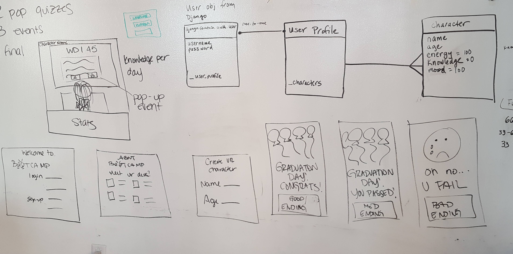
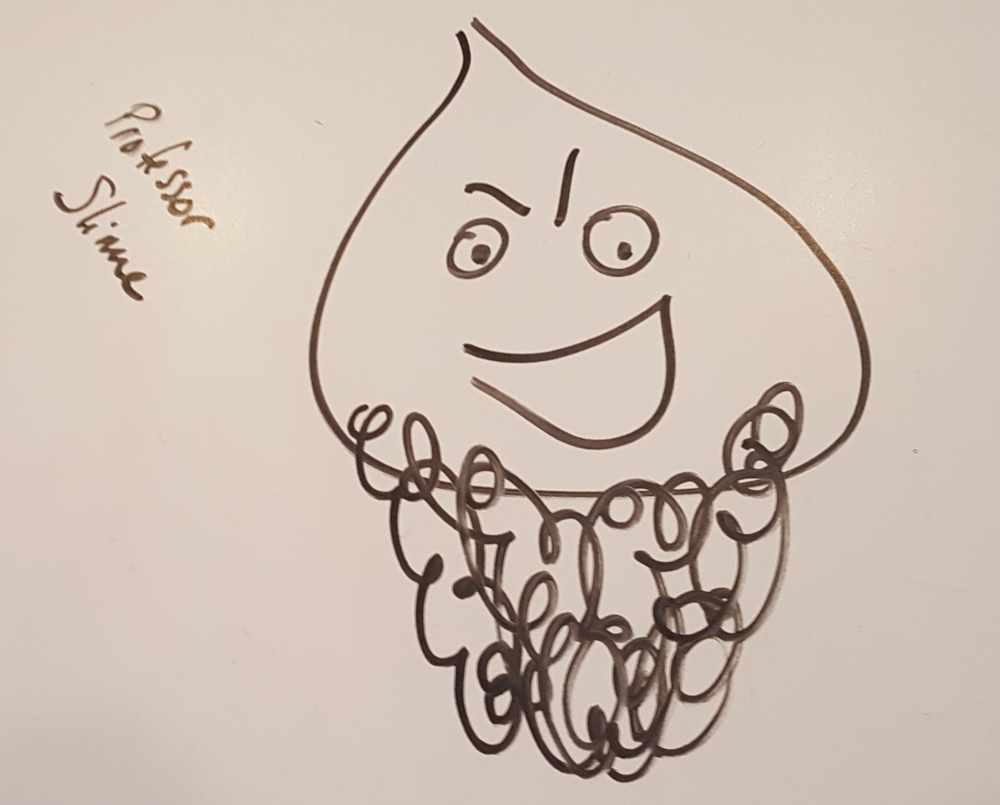
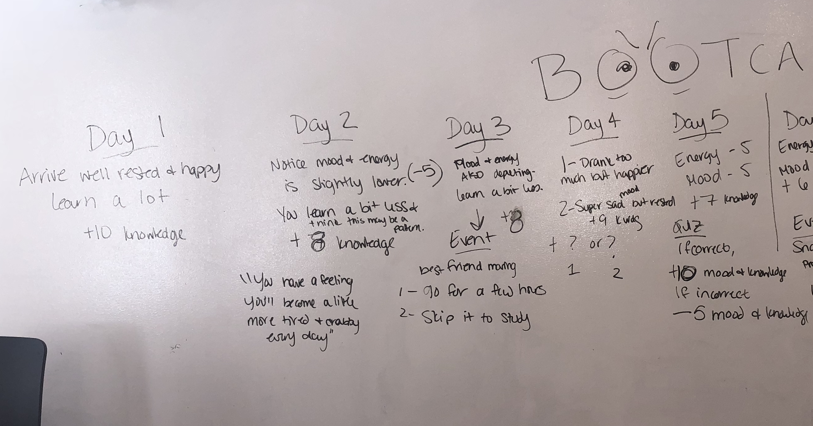
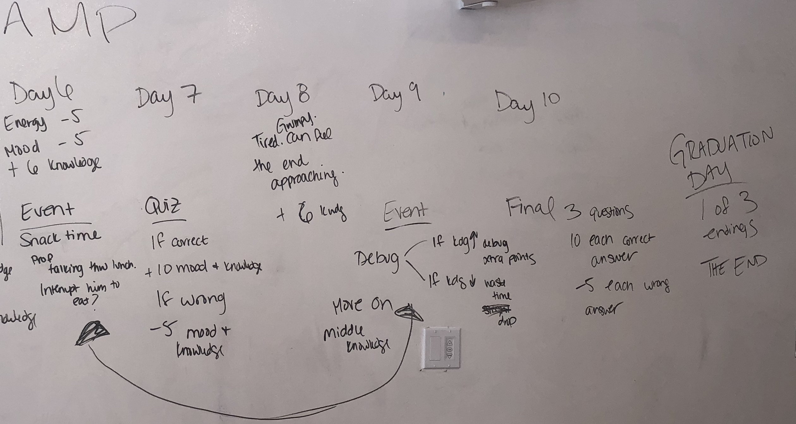

Project 2 - Bootcamp
==============================

## About:
Bootcamp is a text-based adventure game predominantly written in Python. The app has the user play as an aspiring developer attending a ten-day Web Development Immersive program at Grueling Academy. The game follows the developer day-by-day as they make progress toward graduation by facing events that forces them to make challenging decisions which subsequently affects their performance in the program as the game advances.

The game is based on the real-life experiences of the Bootcamp app's developers while attending a 12-week long Web Development immersive program at General Assembly in San Francisco. This app, Bootcamp, is a group project that was created during their time at GA.

## Wireframes:

## User Stories:

## Technologies Used:

The back-end is written in Python, using the Django Framework.
The front-end also used Django and some Jquery in conjunction with static HTML frames.

The app UI uses an actual photograph of the room that the developers primarily worked in while attending the Web Development "Bootcamp" at GA. The game is rendered onto classroom image and contained in the projection screen area at the front of the room in the photograph. The intended users of the app are all fellow Web Developers at GA. This was a significant factor in the game narrative and visual details.

## Features:

- Users can sign up for an account in the Bootcamp app,

- Users can log into the app,

- Users can create characters in the app,

- Users can play the game as the character they created,

- Players go through the game by a responding to prompts that has them make decisions in event situations and pick answers in quiz situations.

- The knowledge, mood, and energy of the player's character is affected positively and/or negatively depending on the quiz answer and event decision picked.

- Players are able to view their "Stats" update as they play the game.

## Future Development:

- Successfully track and update the stats using the Django Rest Framework
- Create and keep track of multiple characters per account
- A "Load Character" button for user to continue playing as different characters
- Show final scores
- Have a scoreboard that all players access and compare Bootcamp high scores on
- Rotating questions for the quizzes stored in a database
- Make the app mobile responsive

## Contributors:

[Teri](http://www.github.com/teripanda), [June](http://www.github.com/juney3), [Chris](http://www.github.com/chrispykan), [Riki](http://www.github.com/mashwhite)
